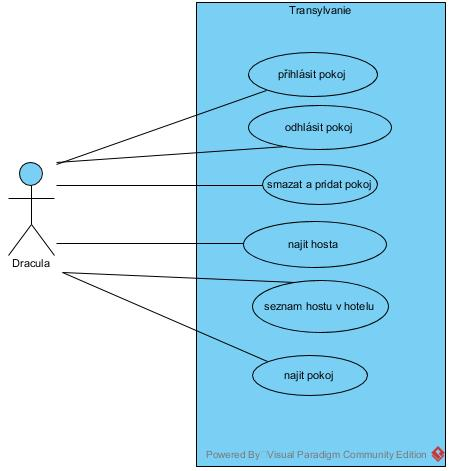
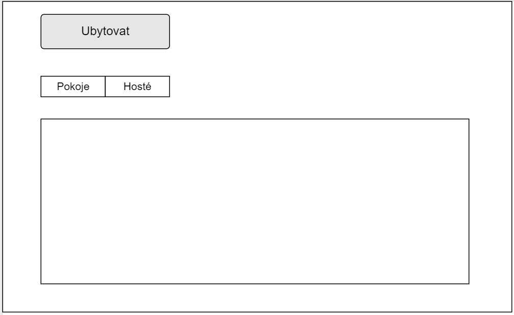
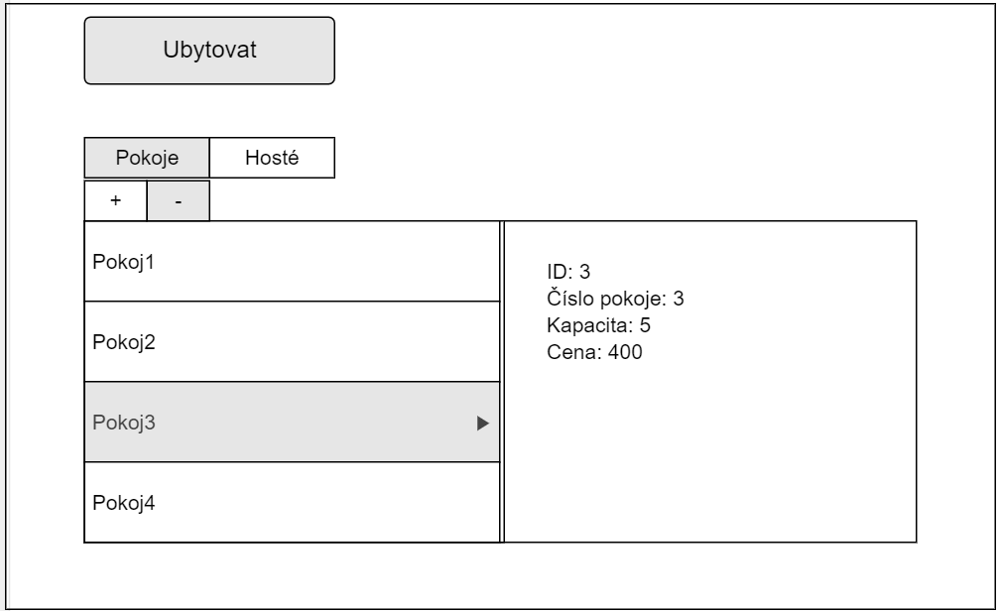
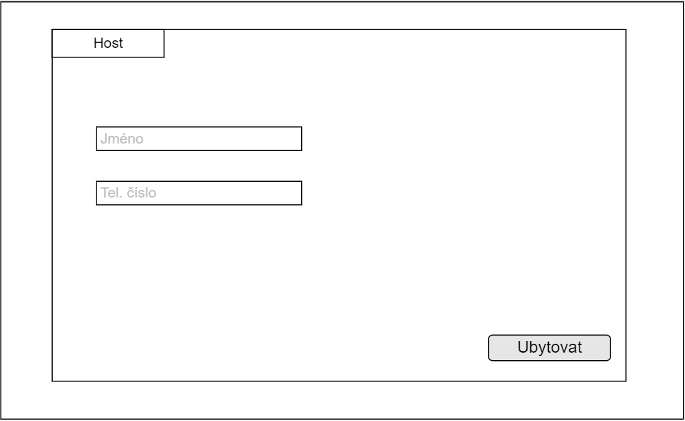

# PV168_Transylvanie

### Specifikace:

### Use case diagram:

### Class diagram:

### Uzivatelske prostredi:

Vstupni obrazovka:

Kdyz uzivatel klikne na tlacitko "Hosti", objevi se seznam hostu. Pri kliknuti na jmeno hosta se vypisou informace o nem. Nebo si uzivatel muze vyhledat hosta podle jmena.

Kdyz uzivatel klikne na tlacitko "Pokoje", objevi se seznam pokoju. Pri kliknuti na pokoj se vypisou informace o nem.

Uzivatel muze pri kliknuti na tlacitko "Přihlásit pokoj", prihlasit urcity pocet hostu do pokoje. Pocet je omezen kapacitou.

Obrazovka, ktera se objevi pri pridavani posledniho hosta v pokoji.

Uzivatel muze odhlasit pokoj. Po napsani cisla pokoje do kolonky, se uzivatli objevi cena za stravene noci.

