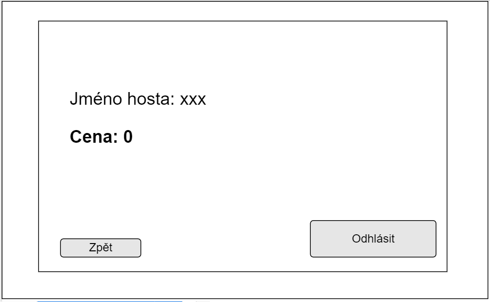

# PV168_Transylvanie

### Téma:
Evidence hostů v hotelu 

### Specifikace:
Aplikace PV168_Transylvanie je určena na evidenci hostu v hotelu, prihlaseni hostu do hotelu (pokoje) a odhlaseni hostu z hotelu (pokoje). 
Evidenci hostu lze provadet pomoci seznamu hostu, kdy po zvolení hosta dostaneme informace o nem. Dalsi moznost evidence hosta lze podle vyhledani hosta podle jmena. 
Evidence pokojů lze delat pomoci seznamu pokoju a nasledne zvolenim pokoje.
Prihlasit hosta do pokoje lze pomoci vyplneni udaju.
Odhlaseni hosta z hotelu lze pomoci odkliknuti okna. Automaticky se vypise cena za stravene noci.

### Use case diagram:

### Class diagram:

### Uzivatelske prostredi:

Vstupni obrazovka:

Kdyz uzivatel klikne na tlacitko "Hosti", objevi se seznam hostu. Pri kliknuti na jmeno hosta se vypisou informace o nem. Nebo si uzivatel muze vyhledat hosta podle jmena.

Kdyz uzivatel klikne na tlacitko "Pokoje", objevi se seznam pokoju. Pri kliknuti na pokoj se vypisou informace o nem.

Uzivatel muze pri kliknuti na tlacitko "Ubytovat", ubytovat hosta do pokoje.

Uzivatel muze odhlasit hosta.Objevi se okno s jmenem hosta a s cenou za stravene noci.

